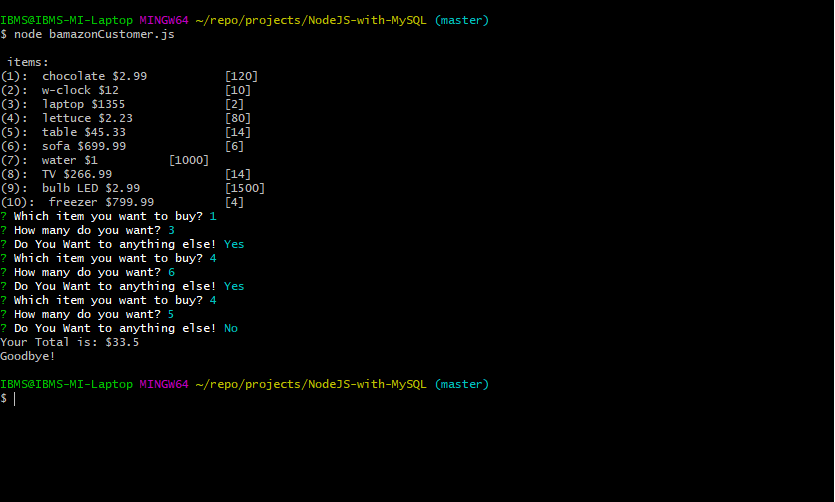
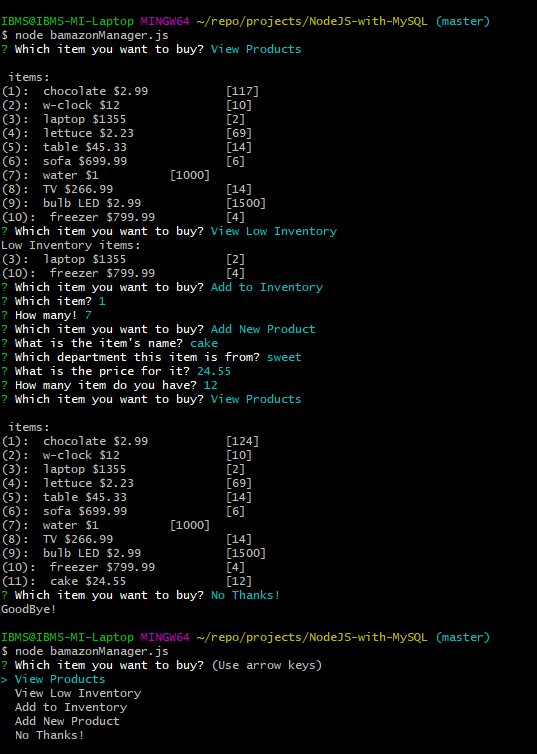
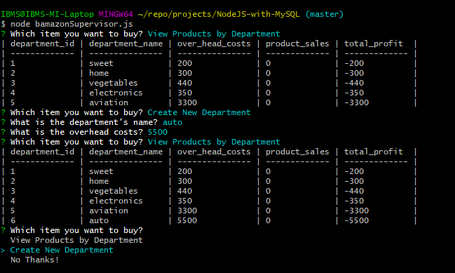

# Node.js & MySQL

### Overview

This assignment is aiming to show the ability of coding using `mysql` and `inquirer` libraries in NodeJS language. And provide a solution application over CLI for interfacing and changing values in SQL. 

### Usage of the Script
*This assignment has three challenge levels, as each file represents a stage of those challenges:

#Challenge #1:
the user can access the access the system and buy from it and then chackout:

Here's an example for the application in the figure below

#Challenge #2:
the user as a `Manager` can access the system and make actions with data within database as of these options:

* View Products for Sale, the app should list every available item: the item IDs, names, prices, and quantities.

* View Low Inventory, then it should list all items with an inventory count lower than five.

* Add to Inventory, your app should display a prompt that will let the manager "add more" of any item currently in the store.

* Add New Product, it should allow the manager to add a completely new product to the store.

Here's an example for the application in the figure below

#Challenge #3:
the user as a `Supervisor` can access the system and make actions with data within database as of these options:

    * View Product Sales by Department, the app should display a summarized table in their terminal/bash window. Use the table below as a guide.
   
    * Create New Department

Here's an example for the application in the figure below

