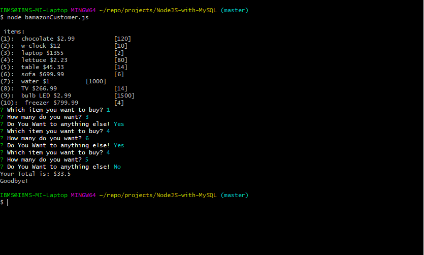
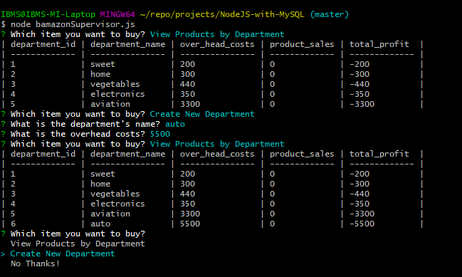

# Store CLI inventory using NodeJS with MySQL

## Overview

This application is aiming to implement the idea of store inventory with Command Line Interface and three levels of accessibility using NodeJS with `mysql` and `inquirer` libraries. 

## Project Dependencies:
This app requires this node package: `mysql` and `inquirer`.

## Basic Usage:
The app runs by navigating into the directory of the app folder, and then type the command  `node <NodeJS file name>` in the command line terminal to run it.
 
## Usage of the Scripts
This application supports three types of users (customer, manager, and supervisor) in three script files, as each file represents one user type:

### User Type 1 (Customer):
The user as a `regular Customer` can access the store and buy from it and then chackout, here's an example for `customer` user type in the application.

### User Type 2 (Manager):
The user as a `Manager` can access the system and make actions with data within database with these privileges:

  * View Products for Sale, the app should list every available item: the item IDs, names, prices, and quantities.

  * View Low Inventory, then it should list all items with an inventory count lower than five.

  * Add to Inventory, your app should display a prompt that will let the manager "add more" of any item currently in the store.

  * Add New Product, it should allow the manager to add a completely new product to the store.

Here's an example for `Manager` user type in the application.

### User Type 3 (Supervisor):
the user as a `Supervisor` can access the system and make actions with data within database with these privileges:

  * View Product Sales by Department, the app should display a summarized table in their terminal/bash window. Use the table below as a guide.

  * Create New Department

Here's an example for `Supervisor` user type in the application.

